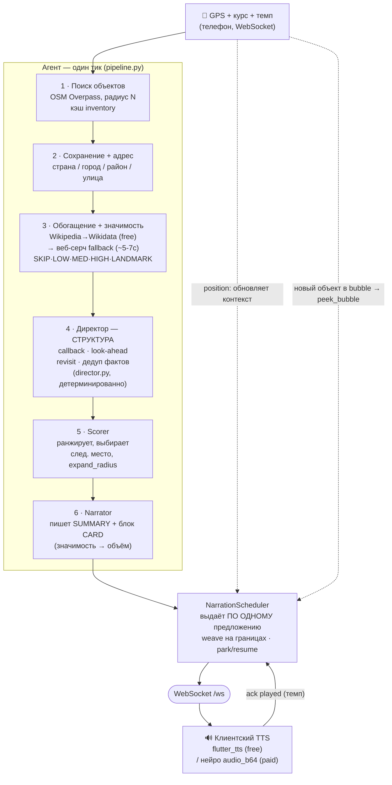
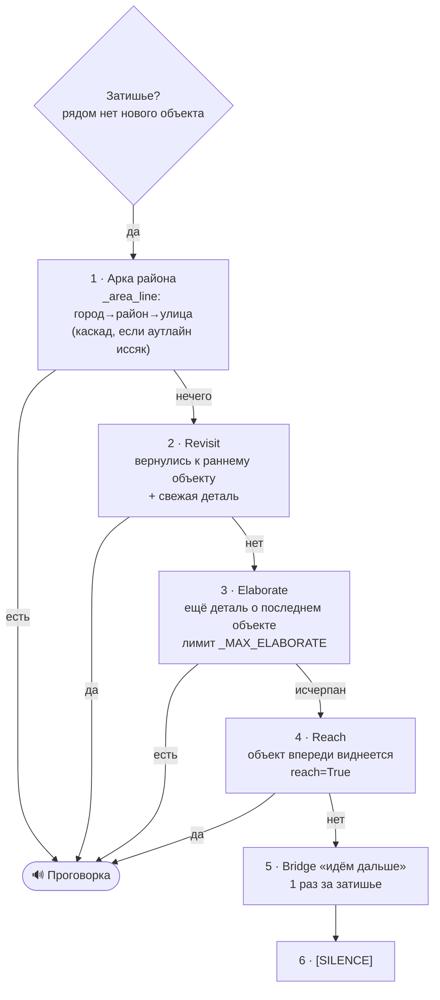
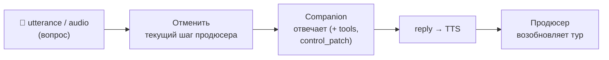

# Архитектура процесса — блок-схема

Как устроен «мозг» аудиогида: один **stateful-оркестратор** гоняет непрерывный цикл и владеет всем
состоянием сессии (FSM, seen-list, история, память). Вокруг — **stateless LLM-роли** и **сервисы**.
Роли не общаются между собой, только через `SessionState`, который передаёт оркестратор.

Диаграммы ниже — на [Mermaid](https://mermaid.js.org) (рендерится на GitHub и в большинстве
Markdown-просмотрщиков).

> Схемы описывают **реактивный** тик («свободная прогулка»). Проактивный режим «Проведи меня»
> (guided) идёт отдельной веткой `orchestrator._guided_tick` (ведение по заранее спланированному
> маршруту + единая арка повествования), а выравнивание трека — отдельным map-matching-каналом.
> Их устройство см. в `CLAUDE.md` (разделы «Guided mode» и «GPS track alignment»).

---

## 1. Цикл на один тик (позиция → рассказ)

**Ключевое:**
- Доставка **по предложению** (`narration_schedule.py`) — новый объект вплетается на границе
  предложения, а не в середине слова; прерванная линия паркуется и **возобновляется** позже.
- `played`-ack задаёт темп: сервер отдаёт следующее предложение, пока текущее ещё играет (буфер в
  1 предложение) — так убирается пауза между фразами.
- Прогрев: рассказ про объект впереди и следующий area-beat **пред-генерируются** в фоне
  (`warm_narration`/`prefetch_area`), чтобы холодная задержка LLM (5-20с) была спрятана за
  проговоркой.

---

## 2. Лестница «затишья» — почему гид не молчит

Когда рядом нет нового объекта, оркестратор (`orchestrator._continue_monologue`) спускается по
лестнице наполнителей, чтобы монолог шёл непрерывно:

> **Инварианты:** факты — только из enrichment (не выдумывать); нет факта → `[SILENCE]`. Каскад
> улица→район→город позволяет говорить про место, когда конкретного объекта рядом нет (Ур. 2 плана —
> расширяем этот каскад и elaborate, чтобы «нечего сказать» не случалось).

---

## 3. Barge-in (вопрос голосом/текстом) — высший приоритет

- Вопрос **отменяет** текущий шаг, отвечает, затем тур **возобновляется** (с мостиком-связкой).
- Ответ Companion — это **весь** ответ; вопрос НЕ ставится повторно как area-beat (чтобы не было
  второго дублирующего beat'а).

---

## Где что лежит (карта кода)

| Слой | Файл |
|---|---|
| Оркестратор (FSM, состояние, лестница затишья) | `backend/app/services/agent/orchestrator.py` |
| Работа на тик (discovery→facts→scorer→narrator, прогрев) | `backend/app/services/agent/pipeline.py` |
| Директор (callback/look-ahead/revisit/дедуп) | `backend/app/services/agent/director.py` |
| Планировщик доставки (по предложению, weave, resume) | `backend/app/services/agent/narration_schedule.py` |
| Роли LLM | `scorer.py` · `narrator.py` · `companion.py` · `planner.py` |
| Память прогулки (граф) | `backend/app/shared/memory.py` (`WalkMemory`) |
| Промпты (CORE + роли) | `backend/prompts/*.txt` |
| Гео/поиск (Overpass, ранжирование, inventory) | `backend/app/services/geo/` |
| Обогащение (wiki/web + фото карточки) | `backend/app/services/enrichment/enricher.py` |
| WS-контракт и домен-модели | `backend/app/shared/schemas.py` |
| Конфиг (все ручки) | `backend/app/config.py` |
| Клиент (карта, TTS/STT, UI) | `mobile/lib/main.dart`, `mobile/lib/ui/` |

Полное описание — в `ARCHITECTURE.md` (рус.) и `CLAUDE.md`.
